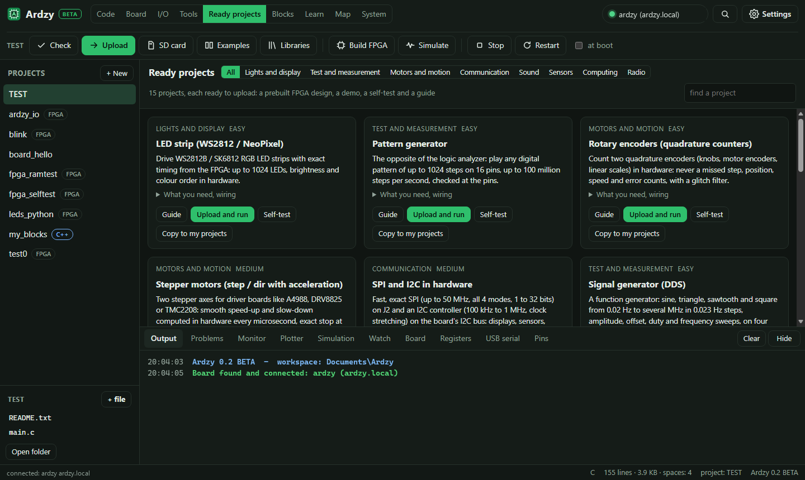

# Ardzy 0.2 BETA

**The Antminer S9 control board, used like an Arduino.**

The control board of an old Antminer S9 bitcoin miner has a Xilinx **Zynq XC7Z010**: two ARM cores
running Linux plus a real FPGA, 512 MB of RAM, Ethernet and about 50 free pins. These boards are
cheap to find. Ardzy turns one into a friendly development board: write an Arduino sketch, a Python
program or a Verilog design on your PC, press **Upload**, and it runs on the board.

> **BETA:** Ardzy 0.2 works and is used every day on a real board, but it is a test version.
> Some parts may still change, and you may find bugs. Please report them in
> [Issues](../../issues). Use it at your own risk: it is hobby software for hardware you own.



## What you get

- **A clean SD card image**: U-Boot 2026.07, Linux 6.18, Debian 13, built 100 % from source by the
  scripts here. Nothing of the original Bitmain firmware is used, and the board's NAND is never touched.
- **The Ardzy app for Windows**: finds the board on the network by itself, and has everything inside:
  - **Code**: Arduino C++ sketches (`setup()` / `loop()`), Python, C and Verilog, with Check, Upload,
    examples, the Arduino library list, a serial-style Monitor and a Plotter.
  - **Build FPGA without Vivado**: Yosys + nextpnr + Ardzy's own bitstream writer, built in.
  - **Simulation**: Verilog testbenches run on the PC (Icarus Verilog) with the waves drawn in the app.
  - **Blocks**: programs made by snapping blocks together, like Scratch, and **FPGA blocks** for hardware.
  - **Learn**: 10 FPGA lessons with interactive drawings, quizzes and a working project each.
  - **Ready projects**: 18 FPGA projects (LED strips, VGA, audio, a RISC-V CPU, SHA-256, FM radio,
    and three AI projects: a network that reads handwritten digits, a small language model that writes
    text, and a network that draws new digits)
    with self-tests and guides.
  - **Instruments** in the FPGA: logic analyzer, PWM / signal generators, frequency meters, UART, I2C.
  - **Board, I/O, Map, System** views: every pin, the board drawn to scale, Linux processes, logs, updates.
  - **Languages**: English, Greek, Russian. **Settings**: colours, size, fonts and more.

## Quick start

You need: an Antminer S9 control board, a 12 V supply (6-pin PCIe plug), a microSD card (4 GB or more),
an Ethernet cable and a Windows PC.

1. Download from [Releases](../../releases): `Ardzy-0.2-BETA-windows.zip` and `Ardzy-0.2-sdcard.img.xz`.
2. Unzip the app and start `Ardzy.exe`. Press **SD card**, choose the image and your card, Write.
   (balenaEtcher works too.)
   The app is not code-signed, so the first time Windows may show "Windows protected your PC":
   click **More info**, then **Run anyway**.
3. Set the boot jumpers to SD card (**JP2 = 1, JP4 = 1**), put the card in, connect Ethernet, power on.
4. Wait about 2 minutes. The app finds **ardzy.local** by itself.

The default login is **root / root**: change it (App: System, Settings; or `passwd` over SSH, or
`password = ...` in `ardzy.txt` on the card) before you connect the board to a network you share.

## Documentation

The full illustrated guides are in [`docs/`](docs/index.html): the hardware, every pin, the board
reference manual, the app, the FPGA projects and the lessons.

## Build it yourself

- **SD card image**: the scripts in [`scripts/`](scripts) (WSL Ubuntu, as root), see
  [Rebuild everything](#rebuild-everything-wsl-ubuntu-2004-as-root) below.
- **Windows app**: Python 3.12 and `python -m pip install pywebview pyinstaller pyserial pyaudiowpatch numpy`.
  The app needs the FPGA tools in `pc_app\tools` (too big for git): copy the `tools` folder from
  the release zip (`_internal\tools`) or build them with `pc_app\fpga\make_toolchain.sh` (MSYS2).
  Then run `pc_app\build_exe.bat`. For a quick test without building: `python pc_app\ardzy_app.py`.

## License

Copyright (C) 2026 chryso.

Ardzy is free software: you can redistribute it and/or modify it under the terms of the
**GNU General Public License version 3** or (at your option) any later version, see [`LICENSE`](LICENSE).
If you share a changed version, keep this copyright notice and share your source code too.
The software Ardzy uses keeps its own licenses: see [`THIRD_PARTY_NOTICES.md`](THIRD_PARTY_NOTICES.md). Ardzy is not made or supported by Bitmain,
AMD/Xilinx or Arduino.

---

# Technical reference

Everything on the SD card is built from source here.

| Part | What | Built from |
|---|---|---|
| `BOOT.bin` | U-Boot **SPL** 2026.07 (replaces the Xilinx FSBL; sets up clocks + 512 MB DDR) | `scripts/02_build_uboot.sh` |
| `u-boot.img` | U-Boot 2026.07, official `bitmain_antminer_s9` board | same |
| `zImage` | Linux **6.18** (Xilinx tree, tag xilinx-v2026.1), compressed swap (zram) | `scripts/03_build_kernel.sh` |
| `system.dtb` | our own clean device tree (ARM side only) | `kernel/zynq-antminer-s9.dts` |
| `boot.scr` | starts Linux; a new kernel is tried once and replaced by the old one if it fails | `scripts/05_make_image.sh` |
| `ardzy.txt` | board settings: name, password, network, time zone, SSH, what loads at power-on | same |
| root partition | **Debian 13 (trixie)** + the `ardzy` tools + Arduino core | `scripts/04_build_rootfs.sh` |

At power-on the **pin-control** FPGA design is loaded (49 pins, PWM, UART, logic analyzer, fans).
Your own designs replace it while Linux runs.

## The Ardzy app (Windows)
Start `pc_app\dist\Ardzy\Ardzy.exe` (or `Ardzy.exe` from the release zip). It finds the board by itself (UDP
port 41414, also over a direct cable). Everything is inside the app, nothing else to install:
- **Code**: Arduino C++ sketches (`setup()` / `loop()`), Python, C, Verilog. **Check**, **Upload** (Ctrl+U),
  **Examples** (16), **Libraries** (the Arduino Library Manager list), Monitor with input, Plotter.
- **Build FPGA** without Vivado: Yosys + nextpnr + Ardzy's own bitstream writer (`pc_app\tools\fpga`,
  library `pc_app\fpga\hdl`). Vivado still works if chosen in Settings.
- **Board**, **I/O**, **Tools** (logic analyzer, PWM, frequency meters, UART, I2C), **Map** (the board drawn to scale or
  as a photo, nets, pin search, pin table), **System** (processes, services, logs, register explorer, speed tests,
  settings, system update).
- **FPGA blocks** (Blocks view, + FPGA design): hardware from blocks, turned into `top.v` + `pins.xdc` + `main.py`
  (`pc_app\ui\fblocks.js`); Simulate and Build and run from the same view.
- **Blocks**: programs made by snapping blocks together, like Scratch; they become an Arduino sketch
  (`pc_app\ui\blocks.js`, Blockly in `pc_app\ui\vendor\blockly`). **Learn**: 10 FPGA lessons and ideas.
  **Ready projects**: 18 FPGA projects with self-tests and guides; the AI ones open in their own screen.
- **App settings** (gear): languages English / Greek / Russian (`pc_app\ui\i18n.js`, Blockly msg el/ru), look (accent, background
  palettes, size, font, density, corners, motion), text, behaviour, export / import / reset (`pc_app\ui\settings.js`).
- **Simulation** (bottom tab, F6): Verilog testbenches run on the PC with Icarus Verilog (`pc_app\tools\icarus`, copied to
  `%LOCALAPPDATA%\Ardzy\icarus` because Icarus can not work in folders with spaces), waves drawn in the app
  (`pc_app\fpga\sim.py`, models `pc_app\fpga\simlib\ardzy_sim.v`, viewer `pc_app\ui\simview.js`).
- **Watch** (bottom tab): live values of the running program (`Ardzy.watch()`, `ardzy.watch()`), recordable to CSV.
  **Data logger** (Board view): the board records sensors, pins and program values to the SD card by itself
  (`board/opt/ardzy/web/datalog.py`, service `ardzy-logger`, logs in `/var/lib/ardzy/logs`).
- **SD card**: writes and checks the image and puts the board settings on it.

Rebuild the exe with `pc_app\build_exe.bat` (needs `pc_app\tools\fpga`, made by `pc_app\fpga\make_toolchain.sh`).

## Flash and start
1. App, **SD card** (or balenaEtcher): write `Ardzy-0.2-sdcard.img.xz` (Releases, or `out/release/` after a build) to a microSD card.
2. Boot jumpers on SD (JP2, JP4), card in the board, power on, wait about 2 minutes.
3. The app finds **ardzy.local**. Browser: http://ardzy.local. PuTTY: `ardzy.local`, **root / root**.

A board that already runs Ardzy: System, Settings and update, **Install update**
(`Ardzy-0.2-update.tar.gz` from Releases, also works for 0.1 boards), then Restart.

## Projects
A **project** is a folder in `projects\`:

| File | What it does |
|---|---|
| `name.ino` (+ `.cpp`, `.h`) | Arduino sketch, compiled on the board (g++ 14), with the libraries it includes |
| `*.v` + `*.xdc` | FPGA design, built by the app (**Build FPGA**) into `name.bit` |
| `something.bit` | an FPGA design (part **xc7z010clg400-1**) |
| `main.py` | Python program, starts after the FPGA is loaded |
| `*.c` (+ `Makefile`) | C program, compiled on the board, then started |
| `run.sh` | any shell commands instead of a program |
| `devices.dtsi` | optional: Linux devices for your FPGA IP (UIO, drivers) |

### `ardzy` commands on the board
```
ardzy list                  projects on the board
ardzy load blink            program FPGA + start program (a sketch is compiled first)
ardzy load blink --default  ...and load it again at every power-on
ardzy build sketch          compile a sketch only
ardzy pin-control           load the pin-control design
ardzy status / ardzy log -f    what runs / program output
ardzy stop / ardzy restart     the program
ardzy peek 0x41200000       read a register      ardzy poke 0x41200000 5   write one
ardzy config [key=value]    board settings (ardzy.txt)
ardzy update bundle.tar.gz  install a system update (then reboot)
```

### Python in your program
```python
from ardzy import MMIO
gpio = MMIO(0x41200000)
gpio.write(0, 0b1010)
print(gpio.read(0))
```

### Safety built in
- `ardzy` refuses bitstreams made for another chip (it checks the chip ID inside the file).
- **Watchdog**: if a design freezes the board, it reboots by itself after about 30 s.
- **Safe mode**: if the board crashes while starting the default project, the next boot skips it.
- **Safe kernel updates**: a new kernel is tried once; if Linux does not come up, the old one returns.
- The Ardzy FPGA library answers every address (0 for unknown ones), so a wrong address cannot
  freeze the board. Designs with Vivado's interconnect still can.

## Board facts used here
- Chip XC7Z010-1 CLG400 (IDCODE 0x03722093), 512 MB DDR3, console UART1 (ttyPS0), 115200.
- DDR settings: copied 1:1 from the FSBL that boots this board. Compared with the
  Vivado hardware file (.xsa) of the old design they differ in exactly 2 registers: row address bit 14 and
  tRFC. The FSBL is set up for 4 Gbit chips (1 GB map, 302 ns refresh); the xsa for 2 Gbit
  chips (512 MB map, 161 ns). This board really has 512 MB (2 Gbit chips), so both work.
- U-Boot keeps its settings in `uboot.env` on the boot partition (the board's own MAC address, saved at the first start, and the
  safe-update flags `ardzy_try`, `ardzy_tried`, `ardzy_rollback`).

## If it does not start (fallback)
Only for images built with your own `fallback/BOOT_fallback.bin` (the boot loader from the
board's original card; it is not in this repository). The boot partition opens in Windows. Rename `BOOT.bin` -> `BOOT_new.bin` and
`BOOT_fallback.bin` -> `BOOT.bin`. The fallback is the proven boot loader from the
old card. It starts the same new Linux. Details in `FALLBACK.txt` on the card.
A USB-serial adapter on the UART header (115200) shows where a boot stops.

## Rebuild everything (WSL Ubuntu-20.04, as root)
```
00_toolchain.sh   ARM GCC 14            00_qemu.sh         newer ARM emulator
01_get_sources.sh U-Boot + kernel src   02_build_uboot.sh  SPL + U-Boot
03_build_kernel.sh kernel + dtb         04_build_rootfs.sh Debian 13 + ardzy tools
05_make_image.sh  SD image -> out/      06_release.sh      out/release/*.img.xz
07_update_bundle.sh update bundle       test_os2_qemu.sh   emulator test of OS 0.2
test_uboot_for_qemu.sh  U-Boot for the emulator tests (keeps uboot.env like the board)
test_legacy_update_qemu.sh  emulator test of the 0.1 -> 0.2 update
```
